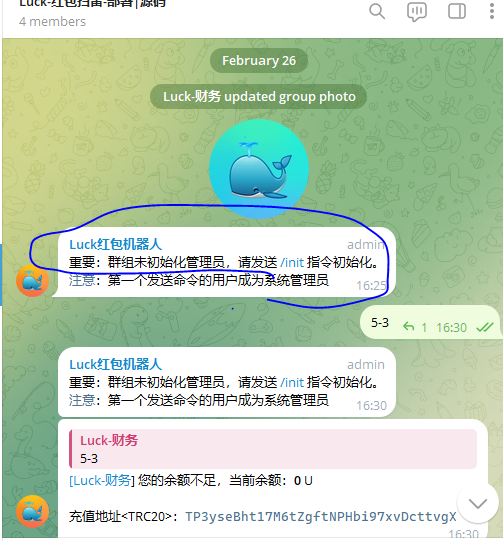
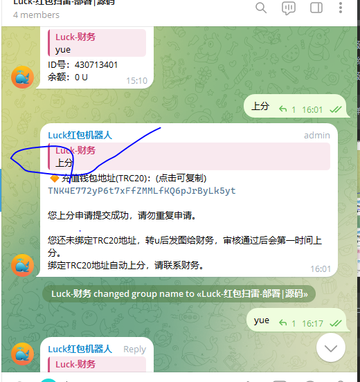
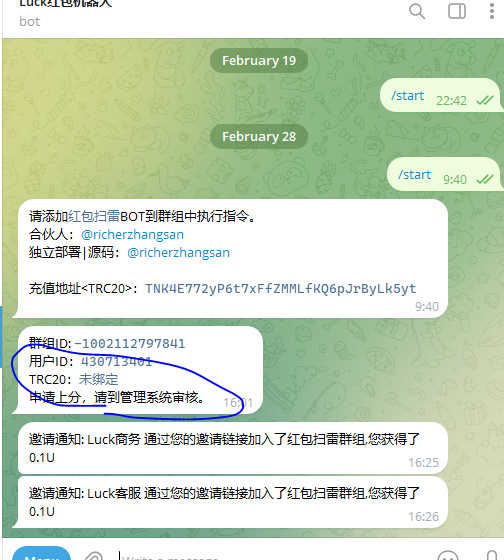
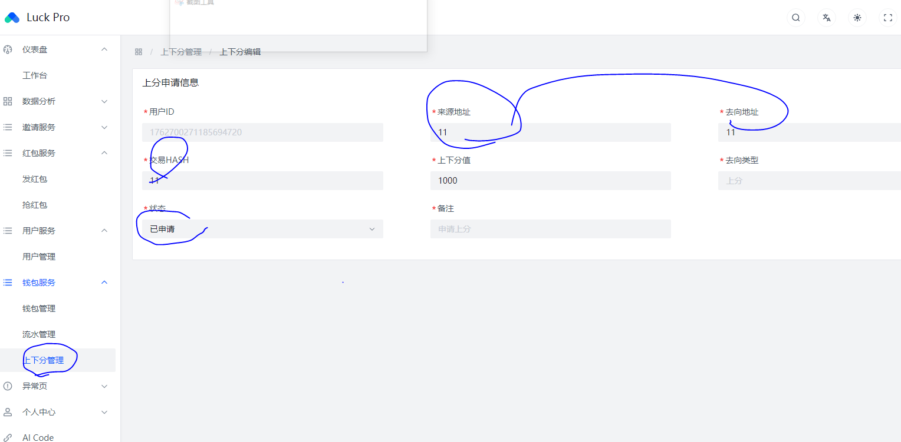
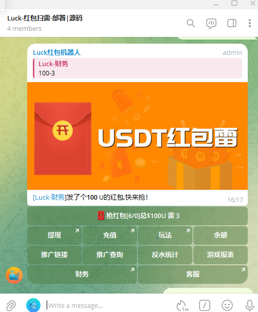

## 基于telegram的红包扫雷系统

````
1. 系统 kotlin + 响应式 + postgresql
2. 编译环境 JDK17

````
```
    部署流程：
    1. 编译源码 输出  luck-vertx-1.0.0-all-optimized.jar
    2. 请替换application.yml中的数据库/域名/bot等
    3. 新建群组并拉入机器人到群组
    4. 新建订阅频道
    5. 数据库文件 /src/main/resource/db.migration

```
请修改以下配置 application_app.yml 修改成  application.yml
`````
vertx:
  pg:
    client:
      port: ${APP_DB_PORT:`5432` }
      host: ${APP_DB_HOST:`localhost` }
      database: ${app.db.database:`db2` }
      user: ${APP_DB_USERNAME:`postgres` }
      password: ${APP_DB_PASSWORD:`DEpn1Y9gM3ys2v6g`}
      maxSize: 5
      ssl: false
      ssl-mode: disable


app:
  luck:
    bot:
      creatorId: ${BOT_CREATOR_ID:`430713401`}
      username: ${BOT_USERNAME:`luck888local_bot`}
      token: ${BOT_TOKEN:`6968916542:AAFseuM2BiI1WhPI5YvIR32CTMyqYU6qyfU`}
      desc: ${BOT_DESC:`luck bot`}
      webhook:
        internalUrl: ${BOT_WEBHOOK_INTERNAL_URL:`https://proxy.abc.ltd/`}
        url: ${BOT_WEBHOOK_URL:`https://proxy.abc.ltd/luck/v1/bot/webhook/handleMessage`}
        secretToken: ${BOT_WEBHOOK_SECRET_TOKEN:`ceq0vd6p2ehd15jkxs62oedq55hu2qq8`}
    limitBid: ${BET_LIMIT_BID:`5000`}
    reservePrice:  ${BET_RESERVE_PRICE:`5`}
    withdrawalLimit:  ${BET_WITHDRAWAL_LIMIT:`10`}
    odds: ${BET_ODDS:`1.8`}
    redPackNumbers: ${BET_RED_PACK_NUMBERS:`6`}
    water: ${BET_WATER:`4`}
    platformWater: ${BET_PLATFORM_WATER:`2.5`}
    partnerWater: ${BET_PARTNER_WATER:`1.5`}
    agentWater: ${BET_AGENT_WATER:`1.5`}
    inviteRebate: ${BET_INVITE_REBATE:`0.1`}
    magic: ${app.luck.bot.webhook.secretToken}
    redPackUrl: ${BET_RED_PACK_URL:`https://proxy.abc.ltd/html/img/luck_boom.jpg`}
    service:
      financeBotUserId: ${BOT_FINANCE_USER_ID:`430713401`}
      finance: ${FINANCE:`https://t.me/luck_caiwu`}
      playRule: ${PLAY_RULE_SERVICE:`https://t.me/luck_dingyue`}
      customerService: ${CUSTOMER_SERVICE:`https://t.me/luck_kefu`}

`````


````
5. 群组内，初始化管理员
````


````
6. 上分
````






````
游戏指令：
    上分      上分申请-根据USDT转账金额上分
    下分100   下分申请
    yue 余额  查询余额
    100/1 100-1 发红包
````



更多 [部署|合作] 请点击TG入群，联系我。

https://t.me/luckhongbao


